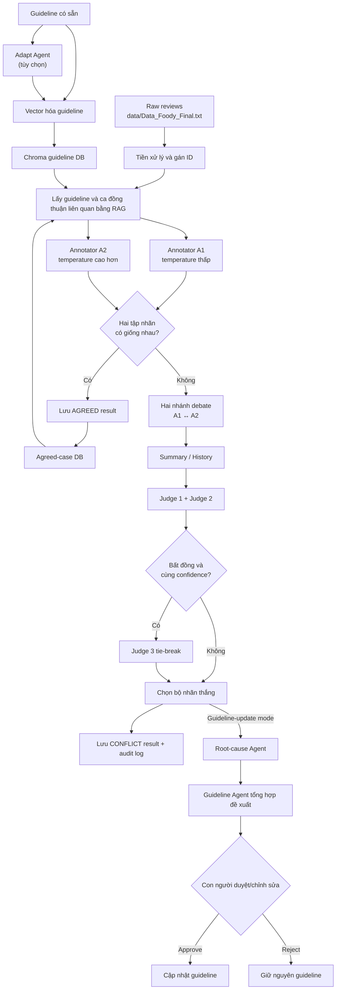

# Multi-Agent ACSA Annotation System

> Hệ thống gán nhãn Aspect Category Sentiment Analysis (ACSA) cho review tiếng Việt bằng nhiều LLM agent, Retrieval-Augmented Generation (RAG) và cơ chế human-in-the-loop.

## Mục lục

- [1. Bối cảnh bài toán](#1-bối-cảnh-bài-toán)
- [2. Mục tiêu của dự án](#2-mục-tiêu-của-dự-án)
- [3. Kiến trúc và luồng hoạt động](#3-kiến-trúc-và-luồng-hoạt-động)
- [4. Vai trò của các agent](#4-vai-trò-của-các-agent)
- [5. Cấu trúc nhãn ACSA](#5-cấu-trúc-nhãn-acsa)
- [6. Cấu trúc repository](#6-cấu-trúc-repository)
- [7. Cài đặt](#7-cài-đặt)
- [8. Chuẩn bị dữ liệu](#8-chuẩn-bị-dữ-liệu)
- [9. Cấu hình Azure OpenAI](#9-cấu-hình-azure-openai)
- [10. Chạy chương trình](#10-chạy-chương-trình)
- [11. Kết quả và trạng thái chạy](#11-kết-quả-và-trạng-thái-chạy)
- [12. Tiếp tục, chạy lại và làm sạch trạng thái](#12-tiếp-tục-chạy-lại-và-làm-sạch-trạng-thái)
- [13. Xử lý lỗi thường gặp](#13-xử-lý-lỗi-thường-gặp)
- [14. Tái lập thí nghiệm và các giới hạn](#14-tái-lập-thí-nghiệm-và-các-giới-hạn)
- [15. Bảo mật](#15-bảo-mật)

## 1. Bối cảnh bài toán

Aspect-Based Sentiment Analysis (ABSA) không chỉ xác định một review là tích cực hay tiêu cực, mà còn xác định người dùng đang đánh giá **khía cạnh nào**. Trong biến thể Aspect Category Sentiment Analysis (ACSA), mỗi review được ánh xạ thành một hoặc nhiều bộ ba:

```text
(ENTITY, ATTRIBUTE, SENTIMENT)
```

Ví dụ:

```text
Review: "Đồ ăn ngon nhưng nhân viên phục vụ chậm."

Nhãn:
- (FOOD, QUALITY, POSITIVE)
- (SERVICE, GENERAL, NEGATIVE)
```

Việc gán nhãn thủ công cho ACSA tốn thời gian và dễ phát sinh bất đồng, đặc biệt khi review chứa nhiều khía cạnh, câu mơ hồ hoặc cảm xúc trái chiều. Dự án này thử nghiệm một quy trình nhiều agent nhằm:

- cho hai annotator đưa ra nhãn độc lập;
- sử dụng guideline và các ca đã đồng thuận làm ngữ cảnh RAG;
- chỉ đưa các ca bất đồng vào tranh biện;
- dùng hội đồng judge để chọn bộ nhãn cuối;
- phân tích nguyên nhân bất đồng;
- đề xuất cải thiện guideline nhưng vẫn giữ quyền quyết định cuối cùng cho con người.

Đây là **pipeline hỗ trợ gán nhãn bằng LLM**, không phải code huấn luyện hoặc fine-tune một mô hình phân loại.

## 2. Mục tiêu của dự án

Repository tập trung vào ba mục tiêu:

1. **Tăng tính nhất quán của nhãn:** mỗi mẫu được hai annotator xử lý và so sánh theo tập bộ ba ACSA đã chuẩn hóa.
2. **Tăng khả năng giải thích:** ca bất đồng có lịch sử tranh biện, bằng chứng guideline, quyết định judge và audit log.
3. **Cải thiện guideline có kiểm soát:** lỗi lặp lại được tổng hợp thành đề xuất; guideline chỉ thay đổi khi người dùng xem, chỉnh sửa và chấp thuận.

## 3. Kiến trúc và luồng hoạt động



### 3.1. Khởi tạo dữ liệu và guideline

- Chương trình đọc `data/Data_Foody_Final.txt`, bỏ qua dòng trống và tạo `data/Data_Foody_Final_with_id.txt`.
- Mỗi review được gán ID dạng `#0001`, `#0002`, ...
- Người dùng có thể dùng `data/guideline.txt` hoặc gọi Adapt Agent để tạo guideline phù hợp với domain đích.
- Guideline đang hoạt động được chia đoạn, embedding bằng `intfloat/multilingual-e5-small` và lưu vào Chroma DB.

### 3.2. Gán nhãn độc lập và kiểm tra đồng thuận

- Pipeline xử lý theo chunk 3 review.
- Annotator A1 và A2 nhận cùng review, phần guideline liên quan và các ca đồng thuận gần nhất.
- A1 và A2 là hai lời gọi LLM độc lập; mặc định chúng dùng temperature khác nhau.
- Kết quả được chuẩn hóa, loại nhãn trùng và so sánh dưới dạng tập `(entity, attribute, sentiment)`, nên thứ tự nhãn không ảnh hưởng đến kết quả.
- Nếu hai tập nhãn giống nhau, mẫu được lưu ngay dưới trạng thái `AGREED` và bổ sung vào agreed-case DB.

### 3.3. Tranh biện và phân xử xung đột

Nếu hai annotator không đồng thuận:

1. Hệ thống chạy hai hướng tranh biện: A1 phản biện A2 và A2 phản biện A1.
2. Mỗi hướng chạy tối đa 2 round trong luồng mặc định.
3. Debate Agent phải giữ nguyên nhãn ban đầu; agent chỉ bảo vệ quan điểm bằng lập luận và bằng chứng guideline.
4. Summary Agent chuẩn hóa và lưu lịch sử trao đổi.
5. Judge 1 đọc phía A1 trước; Judge 2 đọc phía A2 trước để giảm thiên lệch do thứ tự trình bày.
6. Nếu hai judge chọn cùng annotator, đó là kết quả cuối.
7. Nếu hai judge chọn khác nhau, vote có confidence cao hơn được chọn. Judge 3 chỉ được gọi khi hai judge bất đồng và có cùng confidence.

Kết quả cuối giữ nguyên **toàn bộ bộ nhãn** của annotator thắng, đồng thời lưu verdict, confidence và audit log.

### 3.4. Cập nhật guideline có human-in-the-loop

Bước này chỉ chạy trong `guideline-update` mode và chỉ khi có conflict:

1. Root-cause Agent phân tích nguyên nhân dẫn đến bất đồng.
2. Guideline Agent tổng hợp toàn bộ root cause trong cycle thành một đề xuất.
3. Nội dung dự kiến được ghi vào `system_data/pending_rule.txt`.
4. Người dùng có thể mở tệp này để đọc hoặc chỉnh sửa.
5. Chọn `1` để áp dụng phần đã chỉnh sửa, hoặc `2` để từ chối toàn bộ đề xuất của cycle.

Không có thay đổi guideline tự động nếu người dùng chưa chấp thuận.

## 4. Vai trò của các agent

| Thành phần | Trách nhiệm |
|---|---|
| Adapt Agent | Chuyển guideline từ domain nguồn sang domain đích dựa trên các review mẫu. |
| Annotator A1 | Sinh bộ nhãn ACSA độc lập; mặc định temperature thấp để ưu tiên tính ổn định. |
| Annotator A2 | Sinh bộ nhãn độc lập thứ hai; mặc định temperature cao hơn để tạo góc nhìn khác. |
| Debate Agent | Bảo vệ nhãn ban đầu, phản biện phía còn lại và trích dẫn guideline. |
| Summary Agent | Chuẩn hóa phản hồi và quản lý lịch sử hai nhánh tranh biện. |
| Judge 1 & 2 | Đánh giá toàn bộ bộ nhãn và lập luận theo hai thứ tự trình bày khác nhau. |
| Judge 3 | Tie-break khi hai judge chính bất đồng với cùng confidence. |
| Root-cause Agent | Phân tích mẫu lỗi và nguyên nhân gây bất đồng. |
| Guideline Agent | Tổng hợp root cause và đề xuất một bản cập nhật guideline cho mỗi cycle. |
| Human reviewer | Chỉnh sửa, chấp thuận hoặc từ chối đề xuất cập nhật guideline. |

## 5. Cấu trúc nhãn ACSA

Guideline mặc định đi kèm repository dành cho domain nhà hàng theo taxonomy VLSP. Các cặp hợp lệ là:

| Entity | Attribute hợp lệ |
|---|---|
| `RESTAURANT` | `GENERAL`, `PRICES`, `MISCELLANEOUS` |
| `FOOD` | `QUALITY`, `STYLE&OPTIONS`, `PRICES` |
| `DRINKS` | `QUALITY`, `STYLE&OPTIONS`, `PRICES` |
| `AMBIENCE` | `GENERAL` |
| `SERVICE` | `GENERAL` |
| `LOCATION` | `GENERAL` |

Sentiment hợp lệ:

- `POSITIVE`: khen ngợi, hài lòng hoặc đánh giá tích cực;
- `NEGATIVE`: phàn nàn, thất vọng hoặc đánh giá tiêu cực;
- `NEUTRAL`: mô tả khách quan, không có đánh giá rõ ràng, hoặc hai cảm xúc triệt tiêu trên cùng một aspect.

Ví dụ output của một review:

```json
{
  "review_id": "#0001",
  "review": "Đồ ăn ngon nhưng nhân viên phục vụ chậm.",
  "labels": [
    {
      "entity": "FOOD",
      "attribute": "QUALITY",
      "sentiment": "POSITIVE"
    },
    {
      "entity": "SERVICE",
      "attribute": "GENERAL",
      "sentiment": "NEGATIVE"
    }
  ]
}
```

Đọc [data/guideline.txt](data/guideline.txt) để xem đầy đủ quy tắc phân biệt entity, attribute, neutral và cách xử lý cảm xúc trái chiều.

## 6. Cấu trúc repository

```text
Multi_Agent_Paper/
├── agents/                    # Các annotator, debate, judge và guideline agent
├── config/
│   ├── embedding_config.py    # Singleton embedding model
│   └── llm_config.py          # Cấu hình LLM từ biến môi trường
├── core_engine/
│   ├── conflict_filter.py     # So sánh nhãn và route AGREED/CONFLICT
│   ├── data_loader.py         # Đọc dataset đã gán ID
│   ├── update_guideline.py    # Human-in-the-loop guideline update
│   └── workflow_controller.py # Debate, judge, root cause và lưu kết quả
├── data/
│   └── guideline.txt          # Guideline mặc định; dataset không được commit
├── memory_and_history/        # Trạng thái và lịch sử tranh biện
├── models/                    # Pydantic schema dùng chung
├── prompts/                   # Prompt YAML/Python cho các agent
├── rag_system/                # Xây và truy vấn guideline/agreed-case DB
├── utils/                     # Tiền xử lý, timeout/retry và token logging
├── .env.example               # Mẫu cấu hình không chứa secret
├── .gitignore                 # Loại dataset, secret và output khỏi Git
├── main.py                    # Entry point tương tác
└── requirements.txt           # Phiên bản thư viện đã dùng để kiểm tra
```

Dataset, API key, virtual environment, checkpoint, Chroma DB và kết quả chạy không được lưu trong Git.

## 7. Cài đặt

### 7.1. Điều kiện cần

- Python 3.10 trở lên;
- tài khoản Azure OpenAI và ít nhất một chat deployment tương thích;
- kết nối Internet ở lần chạy đầu để tải embedding model;
- khoảng trống đĩa phù hợp cho Python dependencies, Hugging Face cache và Chroma DB.

Code hiện tại đã được kiểm tra với Python 3.13. Embedding mặc định chạy trên CPU, không bắt buộc có CUDA/GPU.

### 7.2. Clone repository

```bash
git clone https://github.com/Namem2006/Multi_Agent_Paper.git
cd Multi_Agent_Paper
```

### 7.3. Tạo virtual environment

Windows PowerShell:

```powershell
python -m venv .venv
.venv\Scripts\Activate.ps1
python -m pip install --upgrade pip
pip install -r requirements.txt
```

macOS/Linux:

```bash
python3 -m venv .venv
source .venv/bin/activate
python -m pip install --upgrade pip
pip install -r requirements.txt
```

Nếu PowerShell chặn script kích hoạt virtual environment, chạy một lần trong cửa sổ hiện tại:

```powershell
Set-ExecutionPolicy -Scope Process -ExecutionPolicy Bypass
.venv\Scripts\Activate.ps1
```

## 8. Chuẩn bị dữ liệu

Vì kích thước, bản quyền và khả năng chứa dữ liệu nhạy cảm, dataset không nằm trong repository.

Tạo tệp:

```text
data/Data_Foody_Final.txt
```

Mỗi dòng không rỗng phải chứa đúng một review:

```text
Phòng sạch sẽ và nhân viên thân thiện.
Đồ ăn ngon nhưng phục vụ hơi chậm.
Quán nằm trong hẻm nên khá khó tìm.
```

Lưu ý:

- mã hóa tệp bằng UTF-8 hoặc UTF-8 with BOM;
- không đặt một review trên nhiều dòng;
- không thêm nhãn hoặc JSON vào cuối dòng;
- dòng rỗng sẽ bị bỏ qua.

Khi chạy, chương trình tự tạo `data/Data_Foody_Final_with_id.txt` theo dạng:

```text
#0001
Phòng sạch sẽ và nhân viên thân thiện.

#0002
Đồ ăn ngon nhưng phục vụ hơi chậm.
```

Tệp được tạo tự động và bị `.gitignore` loại khỏi version control.

## 9. Cấu hình Azure OpenAI

Tạo `.env` từ tệp mẫu.

Windows PowerShell:

```powershell
Copy-Item .env.example .env
```

macOS/Linux:

```bash
cp .env.example .env
```

Điền tối thiểu các biến sau:

```dotenv
OPENAI_API_KEY=your-azure-openai-api-key
BASE_URL=https://your-resource.openai.azure.com
API_VERSION=2024-08-01-preview
DEPLOYMENT_NAME=your-chat-deployment-name
```

### 9.1. Dùng một deployment cho toàn bộ hệ thống

Đây là cấu hình đơn giản nhất. Chỉ cần đặt `DEPLOYMENT_NAME`; annotator, debate, judge, root-cause và guideline agent sẽ cùng sử dụng deployment này.

### 9.2. Tách deployment cho hai annotator

Có thể cấu hình riêng:

```dotenv
DEPLOYMENT_NAME=gpt-4o-mini
ANNOTATOR_1_DEPLOYMENT=gpt-4o-mini
ANNOTATOR_2_DEPLOYMENT=gpt-4.1
ANNOTATOR_1_TEMPERATURE=0.1
ANNOTATOR_2_TEMPERATURE=0.4
```

Tên deployment phải là **tên deployment trong Azure**, không nhất thiết trùng tên model gốc.

### 9.3. Timeout và retry

Các giá trị trong `.env.example` có thể điều chỉnh khi API chậm hoặc rate-limit:

```dotenv
LLM_INVOKE_TIMEOUT_SEC=90
LLM_MAX_RETRIES=10
ANNOTATOR_INVOKE_TIMEOUT_SEC=60
ANNOTATOR_MAX_RETRIES=10
ANNOTATOR_INTER_CALL_SLEEP=1
```

Tăng timeout nếu mạng chậm; tăng thời gian nghỉ giữa các lời gọi nếu gặp rate-limit. Retry cao hơn cũng làm tăng thời gian chờ và có thể tăng chi phí.

## 10. Chạy chương trình

Đứng tại thư mục gốc của repository và chạy:

```bash
python main.py
```

### 10.1. Lần chạy đầu tiên

Chương trình lần lượt yêu cầu:

1. Chọn guideline:
   - `1`: dùng `data/guideline.txt`;
   - `2`: chạy Adapt Agent để tạo guideline cho domain mới.
2. Nhập domain tương ứng với guideline hoặc domain nguồn/đích khi adapt.
3. Chọn chế độ chạy.
4. Nhập số lượng review cần xử lý trong cycle hiện tại.

Ví dụ an toàn để kiểm tra cấu hình:

```text
Choose the active guideline source: 1
Enter domain name: Restaurant
Choose run mode: 1
Enter number of samples: 3
```

Lần đầu embedding model được tải về nên giai đoạn khởi tạo có thể lâu hơn các lần sau.

### 10.2. Hai chế độ chạy

#### Annotation-only

- gán nhãn cho số mẫu đã chọn;
- vẫn giải quyết conflict bằng debate và judge;
- bỏ qua Root-cause Agent và Guideline Agent;
- phù hợp khi chỉ cần tạo nhãn hoặc kiểm tra nhanh pipeline.

#### Guideline-update

- gán nhãn cho một cycle cố định;
- giải quyết conflict bằng debate và judge;
- phân tích root cause;
- tạo tối đa một đề xuất guideline tổng hợp cho cycle;
- yêu cầu con người duyệt trước khi cập nhật.

### 10.3. Khuyến nghị khi chạy

- Bắt đầu với 1–3 review để kiểm tra endpoint, deployment và output.
- Sau khi chạy ổn định mới tăng kích thước cycle.
- Mỗi conflict có thể tạo nhiều lời gọi LLM hơn đáng kể so với một mẫu agreed.
- Không tắt terminal khi đang xử lý một cycle nếu muốn lưu tiến độ đầy đủ.
- Theo dõi token log và hạn mức Azure trước khi chạy dataset lớn.

## 11. Kết quả và trạng thái chạy

Tất cả artifact runtime nằm trong `system_data/`:

| Đường dẫn | Nội dung |
|---|---|
| `progress.json` | Vị trí cuối đã xử lý, guideline và domain đang hoạt động. |
| `adapted_guideline.txt` | Guideline do Adapt Agent tạo, nếu được chọn. |
| `agreed_samples.jsonl` | Các mẫu có hai annotator đồng thuận. |
| `conflict_samples.jsonl` | Conflict của cycle hiện tại trước khi debate. |
| `history_data.json` | Lịch sử hai nhánh tranh biện. |
| `judge_audit_log.jsonl` | Quyết định từng judge, confidence và thông tin tie-break. |
| `result/#xxxx_AGREED.json` | Kết quả mẫu được đồng thuận trực tiếp. |
| `result/#xxxx_WINNER_A1.json` | Conflict mà bộ nhãn A1 được chọn. |
| `result/#xxxx_WINNER_A2.json` | Conflict mà bộ nhãn A2 được chọn. |
| `cause/cause_data.json` | Phân tích root cause trong guideline-update mode. |
| `cause/guideline_cycle_suggestion.json` | Báo cáo đề xuất guideline đã tổng hợp. |
| `pending_rule.txt` | Nội dung chờ con người đọc/chỉnh sửa trước khi duyệt. |
| `chroma_db/` | Vector DB của guideline. |
| `chroma_db_agreed/` | Vector DB của các ca đồng thuận. |
| `llm_token_usage.jsonl` | Chi tiết token theo lời gọi LLM. |
| `llm_token_usage_totals.json` | Tổng hợp token của phiên chạy. |

Các tệp này là output có thể tái tạo và đều bị loại khỏi Git.

## 12. Tiếp tục, chạy lại và làm sạch trạng thái

### Tiếp tục từ vị trí đã lưu

Chạy lại:

```bash
python main.py
```

Pipeline đọc `system_data/progress.json` và tiếp tục từ `last_processed_index`.

### Chạy lại từ review đầu tiên nhưng giữ vector DB/kết quả cũ

Windows PowerShell:

```powershell
Remove-Item system_data\progress.json
```

macOS/Linux:

```bash
rm system_data/progress.json
```

### Xóa toàn bộ trạng thái sinh ra và xây lại từ đầu

Windows PowerShell:

```powershell
Remove-Item system_data -Recurse -Force
```

macOS/Linux:

```bash
rm -rf system_data
```

Chỉ xóa `system_data/` khi không cần giữ kết quả, lịch sử debate hoặc guideline đã adapt.

## 13. Xử lý lỗi thường gặp

### `Cannot prepare Foody dataset` hoặc không tìm thấy dataset

Kiểm tra tệp `data/Data_Foody_Final.txt` có tồn tại, đúng chính tả và đọc được bằng UTF-8.

### Azure trả về 401/403

- kiểm tra `OPENAI_API_KEY`;
- kiểm tra key có thuộc đúng Azure resource trong `BASE_URL`;
- xác nhận resource/deployment đang hoạt động.

### Azure trả về 404 hoặc deployment not found

- `DEPLOYMENT_NAME` phải là tên deployment trên Azure;
- `BASE_URL` phải có dạng `https://<resource>.openai.azure.com`;
- kiểm tra `API_VERSION` được resource hỗ trợ.

### Không tải được embedding model

Lần đầu hệ thống cần tải `intfloat/multilingual-e5-small` từ Hugging Face. Kiểm tra Internet, proxy, firewall và dung lượng cache.

### Lời gọi LLM timeout hoặc rate-limit

- tăng `LLM_INVOKE_TIMEOUT_SEC` và `ANNOTATOR_INVOKE_TIMEOUT_SEC`;
- tăng `ANNOTATOR_INTER_CALL_SLEEP`;
- giảm số review mỗi cycle;
- kiểm tra quota/rate limit của Azure deployment.

### Kết quả mới bị trộn với trạng thái thử nghiệm cũ

Sao lưu phần cần giữ, sau đó xóa `system_data/` và chạy lại từ đầu.

### Chi phí cao hoặc thời gian chạy lâu

Một review agreed cần hai lượt annotation. Một conflict còn cần nhiều lượt debate, summary, judge và có thể thêm root-cause/guideline calls. Hãy thử batch nhỏ và theo dõi `llm_token_usage_totals.json` trước khi mở rộng.

## 14. Tái lập thí nghiệm và các giới hạn

Để tăng khả năng tái lập:

- ghi lại commit hash của code;
- lưu riêng file `.env` hoặc ít nhất tên deployment và tham số temperature, không lưu API key;
- giữ bản guideline được dùng cho từng experiment;
- lưu `progress.json`, token logs, judge audit log và kết quả tương ứng;
- cố định input dataset và thứ tự review.

Các giới hạn cần lưu ý:

- LLM có tính ngẫu nhiên; cùng input có thể không tạo kết quả hoàn toàn giống nhau.
- Confidence là tự đánh giá từ judge LLM, không phải xác suất đã hiệu chuẩn thống kê.
- Đồng thuận giữa hai LLM không bảo đảm nhãn đúng tuyệt đối.
- Agreed-case DB có thể truyền lỗi cũ sang các mẫu sau nếu các ca đồng thuận ban đầu sai.
- Guideline update cần người có chuyên môn xem xét trước khi chấp thuận.
- Repository không kèm dataset và không tự tính benchmark metric.

Vì vậy, output nên được xem là nhãn hỗ trợ nghiên cứu và cần kiểm định thêm trước khi dùng làm ground truth chính thức.

## 15. Bảo mật

- Không commit `.env`, API key hoặc endpoint nội bộ có thông tin nhạy cảm.
- `.env.example` chỉ chứa placeholder và giá trị cấu hình mẫu.
- Nếu key từng xuất hiện trong commit, log, ảnh chụp hoặc tin nhắn, hãy thu hồi và tạo key mới.
- Kiểm tra dataset để tránh gửi dữ liệu cá nhân hoặc dữ liệu bị hạn chế lên dịch vụ LLM bên ngoài.
- Kiểm tra chi phí và chính sách lưu trữ dữ liệu của Azure trước khi xử lý dataset lớn.

---

Repository: [Namem2006/Multi_Agent_Paper](https://github.com/Namem2006/Multi_Agent_Paper)
